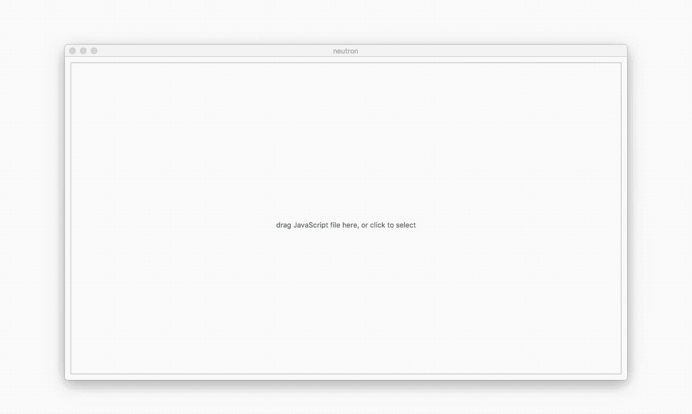

# Neutron

[](https://travis-ci.org/szymonkaliski/Neutron)
[](https://ci.appveyor.com/api/projects/status/github/szymonkaliski/neutron)

Self-contained Node and NPM environment, useful for teaching and sketching.

Supports Windows and OSX.



## What is it exactly?

Neutron brings *download & run* thinking to Node. It packages NPM, auto-detects and auto-installs dependencies, so you only need an editor to get started.

Neutron is based on [Electron](https://electron.atom.io/), so you get everything that Chrome and Node can give you! <sup>(1)</sup>

(1) native packages are sadly not supported right now, Neutron ships with ones I use for workshops often: `serial-port`, `johnny-five` and `node-midi`.

## Why does it exist?

While Node setup might be easy for developers, its still far away from tools like Processing &mdash; *"just `brew` it"* doesn't really work if you're on Windows, or have no `brew` installed, or just don't want to waste few hours on tooling while teaching beginners workshops.

## How do I use it?

1. download binary from [releases tab](https://github.com/szymonkaliski/Neutron/releases)
2. run it

# API

Neutron ships with small API.

```js
var neutron = require('neutron');
```

## Build-in packages

* `neutron.Firmata` - [`johnny-five`](http://johnny-five.io/)
* `neutron.Serial` - [`node-serialport`](https://github.com/EmergingTechnologyAdvisors/node-serialport)
* `neutron.Midi` - [`node-midi`](https://github.com/justinlatimer/node-midi)

## Functions

* `neutron.getWindowSize()` - returns `{ width, height }` of the window
* `neutron.getContentSize()` - returns `{ width, height }` of the content (`innerWidth`, `innerHeight`)
* `neutron.setWindowSize(width, height)` - allows you to set window size from code
* `neutron.isResizable()` - returns `true` if window can be resized
* `neutron.setResizable(shouldBeResizable)` - set window to be resizable or not
* `neutron.getPosition()` - returns window position on screen `{ x, y }`
* `neutron.setPosition(x, y)` - sets window position on screen
* `neutron.isFullScreen()` - returns `true` if window is fullscreened
* `neutron.setFullScreen(shouldBeFullScreen)` - control window fullscreen status
* `neutron.openDevTools()` - opens developer tools
* `neutron.closeDevTools()` - closes developer tools
* `neutron.getDisplays()` - returns displays as detected by electron [docs](https://github.com/electron/electron/blob/master/docs/api/screen.md#screengetalldisplays)
* `neutron.getElectronRemote()` - returns `require('electron').remote`
* `neutron.getElectronWindow()` - returns `require('electron').remote.getCurrentWindow()`
